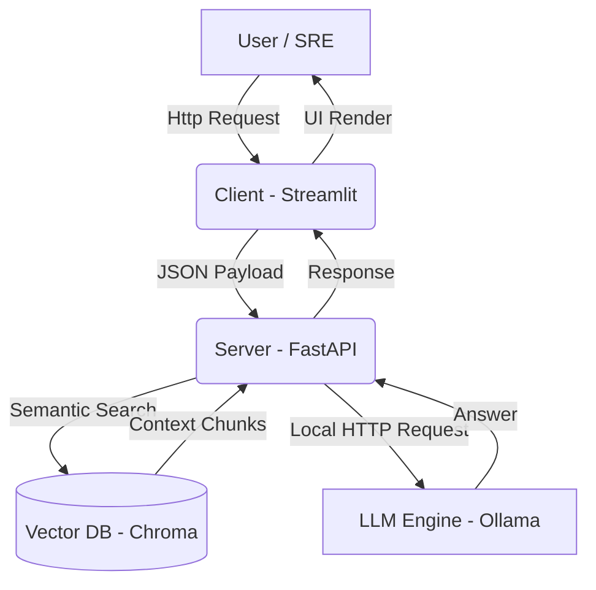

# Ghost-Shell: RAG-Based Troubleshooting Assistant


-orange)

> [!NOTE]
> **Uma ferramenta de SRE Assistida por IA que reduz o tempo médio de resolução analisando logs e documentação de
infraestrutura.**

---

## Sobre o Projeto

É uma arquitetura RAG projetada para atuar como um "Engenheiro Sênior de Plantão". Ele ingere documentação técnica (
Terraform, AWS, CUDA), indexa em um banco vetorial e fornece diagnósticos para erros de infraestrutura sem que nenhum
dado sensível saia da sua máquina.

### Principais Features

* **Intelligent Log Analysis:** Cole um stack trace de erro (Python/Terraform/AWS) e receba a causa raiz + solução.
* **Privacidade Total (Local LLM):** Inferência rodando localmente via Ollama, garantindo que logs corporativos não
  sejam enviados a APIs de terceiros.
* **Knowledge Base Customizável:** Ingestão de arquivos Markdown/PDF para treinar o modelo em contextos específicos da
  empresa.
* **IaC Ready:** Infraestrutura modularizada para deploy.

---

## Arquitetura



### Decisões Técnicas

| Componente       | Tecnologia        | Motivação                                                                                            |
|------------------|-------------------|------------------------------------------------------------------------------------------------------|
| **Client**       | Streamlit         | Prototipagem rápida de UI.                                                                           |
| **Server**       | FastAPI           | Performance assíncrona e documentação automática (Swagger).                                          |
| **LLM Engine**   | Ollama + Qwen 2.5 | Execução local de alta performance, otimizado para rodar em GPUs com 4GB de VRAM (quantização GGUF). |
| **Vector Store** | ChromaDB          | Simplicidade de setup local e persistência eficiente.                                                |
| **Orchestrator** | Docker Compose    | Simulação do ambiente de produção com isolamento de serviços de IA e Backend.                        |

---

## Estrutura do Projeto

A organização de diretórios reflete a separação de conceitos, onde `src/server` contém a lógica do RAG, `src/client` a
interface, e os modelos são persistidos localmente:

```bash
ghost-shell/
├── config/                  # Configurações globais e env vars
├── data/                    # Persistência de dados
│   ├── chroma_db/           # Volume do Banco Vetorial
│   ├── ollama/              # Volume dos Modelos LLM (GGUF)
│   └── raw_docs/            # Knowledge Base (.md, .pdf)
├── infra/                   # Infraestrutura como Código
│   └── modules/             # Módulos Terraform reutilizáveis
├── src/
│   ├── client/              # Frontend (Streamlit)
│   └── server/              # Backend (FastAPI)
├── docker-compose.yml       # Orquestração dos serviços (App + DB + Ollama)
└── README.md

```

---

## Como Rodar Localmente

### Pré-requisitos

* Docker & Docker Compose
* NVIDIA Container Toolkit (para repasse da GPU aos containers)

### Passo a Passo

1. **Clone o repositório:**

```bash
git clone [https://github.com/Otavio-CB/ghost-shell-rag.git](https://github.com/Otavio-CB/ghost-shell-rag.git)
cd ghost-shell
```

2. **Suba os Containers:**

```bash
docker-compose up -d --build
```

4. **Acesse a Aplicação:**

* **Client:** `http://localhost:8501`
* **Server Swagger:** `http://localhost:8000/docs`
* **Ollama API:** `http://localhost:11434`
